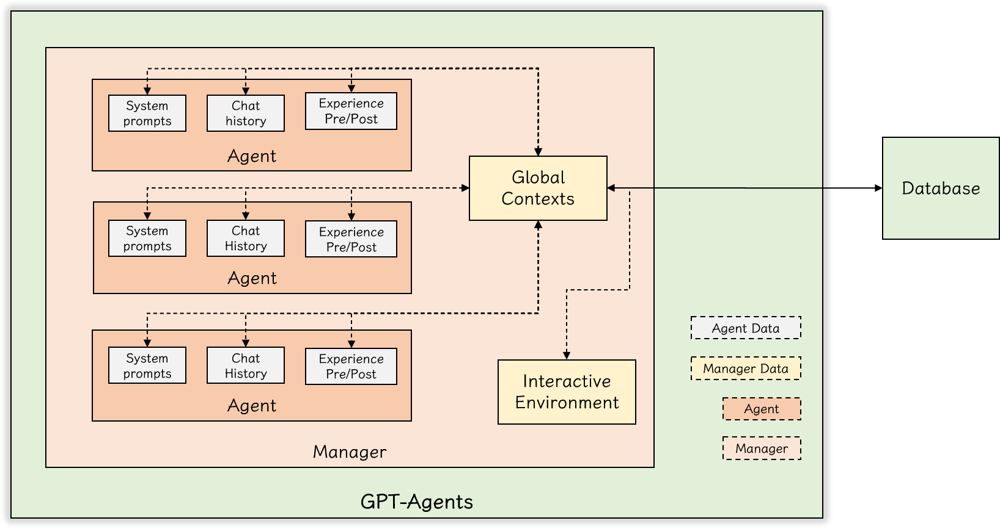

# GPT-Agents

Multiple GPT Agents to have brainstorms and make decisions

## Architecture



## Examples

https://hansimov.github.io/GPT-Agents/

## Setup

Create python venv:

```bash
python -m venv llm
./llm/Scripts/activate # Windows
source ./llm/bin/activate # Linux
```

Install packages:

```bash
python -m pip install --upgrade --force-reinstall -r requirements.txt
```


## References
* ading2210/poe-api: A reverse engineered Python API wrapper for Quora's Poe, which provides free access to ChatGPT, GPT-4, and Claude.
  * https://github.com/ading2210/poe-api

* dsdanielpark/Bard-API: The unofficial python package that returns response of Google Bard through cookie value.
  * https://github.com/dsdanielpark/Bard-API

* acheong08/EdgeGPT: Reverse engineered API of Microsoft's Bing Chat AI
  * https://github.com/acheong08/EdgeGPT